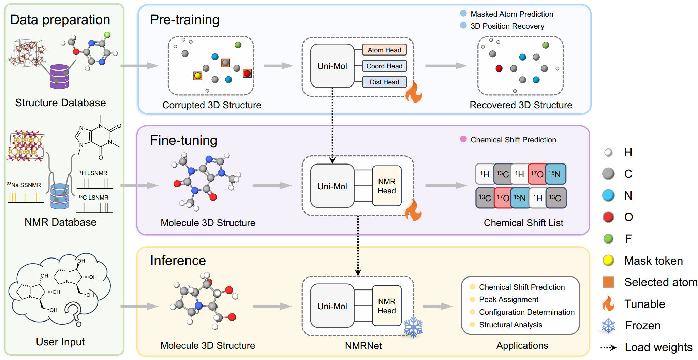

<div align="center">

# NMRNet: toward a unified benchmark and framework for deep learning-based prediction of nuclear magnetic resonance chemical shifts

Fanjie Xu, Wentao Guo, Feng Wang, Lin Yao, Hongshuai Wang, Fujie Tang*, Zhifeng Gao*, Linfeng Zhang, Weinan E, Zhong-Qun Tian, Jun Cheng* (* indicates corresponding authors)

[](https://doi.org/10.1038/s43588-025-00783-z)
[](https://zenodo.org/records/19142375)
[](LICENSE)
[](https://ai4ec.ac.cn/apps/nmrnet)

</div>

---

This is the **official implementation** of the code related to the paper *"Toward a unified benchmark and framework for deep learning-based prediction of nuclear magnetic resonance chemical shifts"*.

## 📖 Overview



**NMRNet** is a unified deep learning framework for NMR chemical shift prediction. It consists of four synergistic modules:

| Module | Description |
|--------|-------------|
| **Data Preparation** | Provides structure and NMR data |
| **Pre-training** | Uses pure structural information for self-supervised tasks, including masked atom prediction and 3D position recovery |
| **Fine-tuning** | Supervised NMR chemical shift prediction |
| **Inference** | Fine-tuned NMRNet model parameters are frozen and applied to various tasks |

Pre-training weights and datasets for all fine-tuning stages are available on [Zenodo](https://zenodo.org/records/19142375). An online web app is available for [NMR chemical shift prediction](https://ai4ec.ac.cn/apps/nmrnet).

---


## 🗞️ News

> ⚠️ **Note**
> Please note that the Zenodo records may be updated. Make sure to check the latest version.

| Date | Update |
|------|--------|
| 🎞️ **2026.03.21** | The fine-tuned weights have been updated and released on [Zenodo](https://zenodo.org/records/19142375) |
| 📄 **2025.03.28** | 🎉🎉🎉 Paper published on [Nature Computational Science](https://doi.org/10.1038/s43588-025-00783-z) |
| 🔗 **2025.03.13** | The web application is available on the [AI4EC platform](https://ai4ec.ac.cn/apps/nmrnet) |
| 🎞️ **2024.12.05** | The LMDB-format datasets have been updated and released on [Zenodo](https://zenodo.org/records/14279498) |
| 📄 **2024.08.28** | Paper published on [arXiv](https://arxiv.org/abs/2408.15681) |
| 🎞️ **2024.08.14** | Dataset and trained weights released on [Zenodo](https://zenodo.org/records/13317524) |
| 🏷️ **2024.08.14** | Code has been released on [GitHub](https://github.com/Colin-Jay/NMRNet) |
---

## ⚙️ Installation

The installation steps for Linux systems are as follows:

```bash
pip install torch==1.13.1+cu116 torchvision==0.14.1+cu116 torchaudio==0.13.1 --extra-index-url https://download.pytorch.org/whl/cu116
pip install scikit-learn==1.3.2
pip install ase==3.22.1
pip install ./unicore-0.0.1+cu116torch1.12.0-cp38-cp38-linux_x86_64.whl
pip install pandas==2.0.3
```

Detailed installation tutorials for other versions of the unicore package can be found at: [Uni-Core](https://github.com/dptech-corp/Uni-Core).

---

## 🚀 Usage

### 1. Prepare your dataset

Prepare your dataset for pre-training or fine-tuning in lmdb format and place it in the [data](./data) folder. You may refer to the [demo](./demo) as a reference.

### 2. Download pre-trained weights

Place the pre-trained weights into the [weights](./weight) folder (skip this step if re-training from scratch). Pre-trained weights are available on [Zenodo](https://zenodo.org/records/19142375).

### 3. Run training or inference

#### Pre-training (cutoff radius)

```bash
sh script/pretrain_rcut.sh
```

#### Fine-tuning (5-fold cross-validation)

```bash
sh script/finetune_cv.sh
```

Details of the original [Uni-Mol](https://openreview.net/forum?id=6K2RM6wVqKu) architecture can be found in the paper.

#### Inference

A demo notebook is available in the [notebook](./demo/notebook) folder.

An online service is also available at [ai4ec](https://ai4ec.ac.cn/apps/nmrnet) and [bohrium](https://bohrium.dp.tech/apps/nmrnet001).

---

## 📜 Citation

If you find NMRNet useful in your research, please cite:

```bibtex
@article{xu2025toward,
  title={Toward a unified benchmark and framework for deep learning-based prediction of nuclear magnetic resonance chemical shifts},
  author={Xu, Fanjie and Guo, Wentao and Wang, Feng and Yao, Lin and Wang, Hongshuai and Tang, Fujie and Gao, Zhifeng and Zhang, Linfeng and E, Weinan and Tian, Zhong-Qun and others},
  journal={Nature Computational Science},
  volume={5},
  number={4},
  pages={292--300},
  year={2025},
  publisher={Nature Publishing Group US New York}
}
```

---

## ⚠️ License

This project is licensed under the terms of the **MIT License**. See [LICENSE](./LICENSE) for additional details.

---

## 📬 Contact

For questions and issues, please contact the author [xufanjie@stu.xmu.edu.cn](mailto:xufanjie@stu.xmu.edu.cn) or open a GitHub issue.


---

<div align="center">
<sub>
State Key Laboratory of Physical Chemistry of Solid Surfaces · Xiamen University
</sub>
</div>
