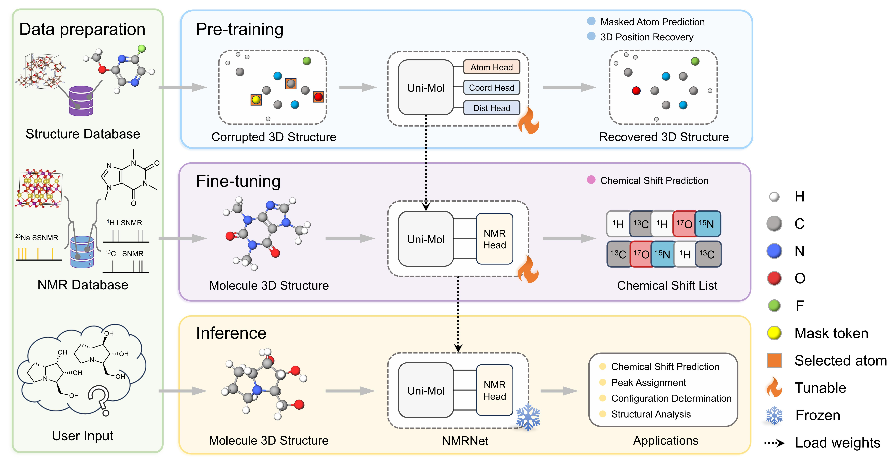

NMRNet
==================================================

This is the official implementation of the code related to the paper "Towards a Unified Benchmark and Framework for Deep Learning-Based Prediction of Nuclear Magnetic Resonance Chemical Shifts".

Authors: Fanjie Xu, Wentao Guo, Feng Wang, Lin Yao, Hongshuai Wang, Fujie Tang\*, Zhifeng Gao\*, Linfeng Zhang, Weinan E, Zhong-Qun Tian, Jun Cheng\* (\* are corresponding authors).

Our pre-training weights and datasets for all fine-tuning stages can be downloaded on [zenodo](<https://doi.org/10.5281/zenodo.13317524>). The online web app can be used  [NMR chemical shift prediction](https://bohrium.dp.tech/apps/nmrnet001).



Four modules of the NMRNet framework:

- Data preparation, providing structure and NMR data. 
- Pre-training, using pure structural information for self-supervised tasks, including masked atom prediction and 3D position recovery. 
- Fine-tuning, for supervised NMR chemical shift prediction. 
- Inference, where the fine-tuned NMRNet model parameters are frozen and applied to various tasks.


Installation
----

The installation steps for Linux systems are as follows:

```
pip install torch==1.13.1+cu116 torchvision==0.14.1+cu116 torchaudio==0.13.1 --extra-index-url https://download.pytorch.org/whl/cu116
pip install scikit-learn==1.3.2
pip install ase==3.22.1
pip install ./unicore-0.0.1+cu116torch1.12.0-cp38-cp38-linux_x86_64.whl
pip install pandas==2.0.3
```

Detailed installation tutorials for other versions of unicore package can be found at: [Uni-Core](https://github.com/dptech-corp/Uni-Core).


## Usage

First, you need to prepare your dataset for pre-training or fine-tuning in lmdb format and put it in [data](./data) folder (you may refer to the [demo](./demo) as a reference). 

Subsequently, please put the pre-trained weights into the [weights](./weight) folder (skip this step if re-training). Our pre-trained weights can be downloaded on [zenodo](<https://doi.org/10.5281/zenodo.13317524>).

Then, you can pre-train or fine-tune on your dataset. Here are demo scripts for pre-training and fine-tuning, please adjust the paths and hyperparameters according to your needs.

**Pre-training in form of cutoff radius**

```
sh script/pretrain_rcut.sh
```

**Fine-tuning with 5-fold cross-validation**

```
sh script/finetune_cv.sh
```

Details of the original [Uni-Mol](https://openreview.net/forum?id=6K2RM6wVqKu) can be found in the paper.

**Inference**

A demo notebook can be found in the [notebook](./demo/notebook) folder.

Citation
--------

Please kindly cite us after publication if you use our data or code.

License
-------

This project is licensed under the terms of the MIT license. See [LICENSE](./LICENSE) for additional details.
